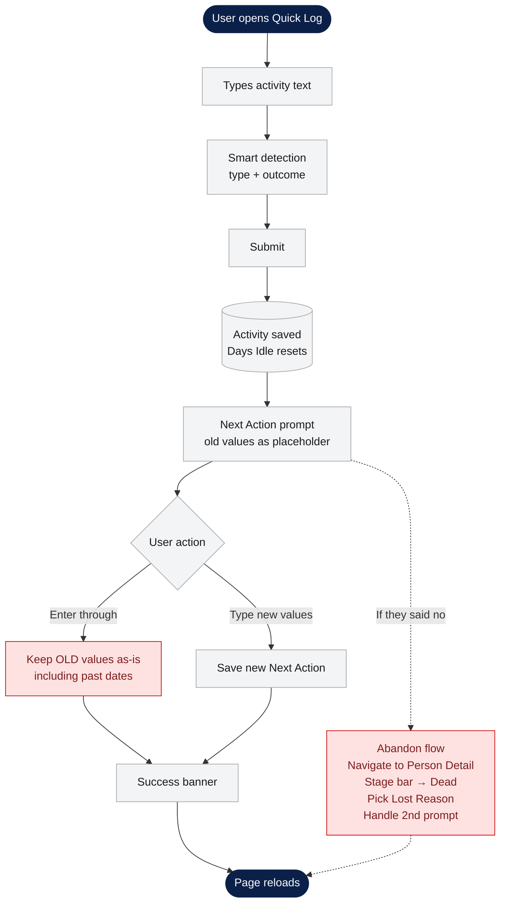
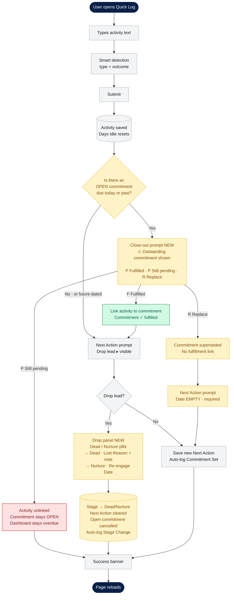

# Zoho Integration Change Notice — Next Action Lifecycle

**For:** IT team implementing the Zoho CRM module configuration and `lib/providers/zoho.ts`
**Relates to:** DESIGN-SPEC.md §2.4, §4.3, §5.1, §5.9, §5.10, §12, Phase 1 Zoho checklist
**Status:** Spec change locked 2026-04-10. Frontend development in progress.

---

## 1. What changed and why

### The problem this solves

Previously, a prospect's Next Action lived on the Person record as three fields: `Next Action Type`, `Next Action Detail`, `Next Action Date`. Every time a user logged a new activity, the UI prompted them to update these fields. This worked operationally but had two structural gaps:

1. **No record of what was actually done against a prior Next Action.** If the user logged a new activity and pressed Enter through the prompt, the old Next Action was silently preserved with no indication of whether it had been completed, replaced, or left pending. The history was ambiguous.
2. **The overdue flag could clear on unrelated activity.** The dashboard's overdue indicator was computed from `nextActionDate <= today` combined with idle days. Logging any activity reset the idle counter, so the overdue flag could clear even when the actual outstanding Next Action was still open. The dashboard's "needs attention" list drifted out of sync with reality within days.

### The flow change

Here's what the activity-log flow looked like before:

The red nodes are the two structural gaps. Now here's the new flow:

The yellow nodes are the new steps. The green node is an explicit close-out (commitment fulfilled). The red node is deliberate: when the user picks "Still pending," the dashboard continues to show the prospect as overdue — because the open commitment wasn't actually handled. This is the behavior change that keeps the overdue list in sync with reality.

### The data model fix

Next Action is now modeled as a **lifecycle event written to the Activity Log**. Every time a Next Action is set or changed, the frontend writes a new row to Activity Log with `Activity Type = Commitment Set` and a status of `open`. When the user subsequently closes it out (via Fulfilled / Still Pending / Replace or by dropping the lead), the frontend updates the row's status to a terminal state.

The overdue flag is now driven by "is there any open Commitment Set row due on or before today?" — not by the Person-level `Next Action Date` field.

**The Person-level Next Action fields still exist** for convenience (quick display, Zoho native views, Zoho automations) but they represent the *current* commitment only. The Activity Log is the source of truth for history and fulfillment.

---

## 2. What you need to change in Zoho

### 2.1 Add fields to the Activity Log module

The Activity Log module (created per DESIGN-SPEC §2.4) needs six new fields:

| Field | Zoho Type | Required | Notes |
|---|---|---|---|
| `Fulfills Commitment` | Lookup (self-reference to Activity Log) | No | When an activity fulfills a prior Commitment Set row, this lookup points to that row's ID |
| `Commitment Type` | Picklist | Conditional | Snapshot of Next Action Type at the moment the commitment was made. Only populated when Activity Type = Commitment Set. Values match Next Action Type picklist exactly. |
| `Commitment Detail` | Text (250 chars) | Conditional | Snapshot of Next Action Detail. Only populated when Activity Type = Commitment Set. |
| `Commitment Due Date` | Date | Conditional | Snapshot of Next Action Date. Only populated when Activity Type = Commitment Set. |
| `Commitment Status` | Picklist | Conditional | Values: `open`, `fulfilled`, `superseded`, `cancelled`. Only populated when Activity Type = Commitment Set. Initial value is `open`. |
| `Commitment Closed Date` | Date | Conditional | Date the commitment moved to a terminal state (null while `open`). Only populated when Activity Type = Commitment Set. |

All fields are nullable. They're only meaningful on rows where `Activity Type = Commitment Set`. For all other Activity Log rows (Calls, Emails, Notes, etc.) they remain null — with one exception: `Fulfills Commitment` is populated on any activity that was used to close out a Commitment Set row via the "Fulfilled" path.

### 2.2 Add a value to the Activity Type picklist

The Activity Type picklist gains one new value: **`Commitment Set`**.

Like `Prospect Added`, this is a system-only activity type. It is never manually creatable by users. It must exist as a valid picklist value so the frontend can write to it via the Zoho API. **Do not add it to any "select activity type" UI surface in Zoho.**

Updated Activity Type picklist (12 values total):

- Call
- Email
- Meeting
- Note
- Text Message
- LinkedIn Message
- WhatsApp
- Stage Change *(system)*
- Document Sent
- Document Received
- Reassignment *(system)*
- Prospect Added *(system)*
- **Commitment Set *(system — NEW)*** 

### 2.3 Add a new picklist: Commitment Status

Create a new picklist called **`Commitment Status`** with exactly these four values (in this order):

1. `open`
2. `fulfilled`
3. `superseded`
4. `cancelled`

All lowercase, no spaces. These are API keys the frontend will write verbatim. Do not rename them for display purposes in Zoho — or if you do, ensure the API name stays exact.

### 2.4 Module permissions

- Standard users (Chad, Ken) must be able to **read** Commitment Set rows and their fields
- Standard users must be able to **create** Commitment Set rows and update `Commitment Status`, `Commitment Closed Date`, and `Fulfills Commitment`
- No user should be able to **delete** Commitment Set rows (audit trail must be preserved)

---

## 3. What changes in the Zoho-side automations

### 3.1 Daily overdue email to Chad

Previously: "prospects where `Next Action Date < today` and stage is active"

**Now:** "prospects where there is at least one Activity Log row with `Activity Type = Commitment Set` AND `Commitment Status = open` AND `Commitment Due Date <= today`, and the prospect's stage is active (not Nurture/Dead/Funded)"

This is the critical difference. If the old query is kept in place, users will get spammed about prospects they've already closed out, and they will NOT get notified about prospects where a new open commitment was created today.

### 3.2 Funded alert email to Eric

No change.

---

## 4. The data model semantics you need to understand

### 4.1 What "open" means

A commitment is `open` from the moment it is created until the moment a user explicitly closes it out. The frontend enforces these transitions; Zoho just stores the state. There is no time-based expiration — an overdue commitment is still `open` in the data, it's just that the UI renders it with a warning.

### 4.2 How commitments are created

The frontend writes a new row when any of the following happen:
- User confirms the post-activity Next Action prompt (with any values — new, changed, or unchanged-but-close-out-was-required)
- User confirms the post-stage-change prompt
- User edits Next Action via the Next Action Bar on the person detail page
- A new prospect is created with Next Action fields populated

The frontend **does not** write a new row when the user hits Enter through the post-activity prompt without changing anything AND there is no close-out required. In that case, the existing open commitment stays untouched.

### 4.3 How commitments are closed out

The frontend updates an existing row's `Commitment Status` and `Commitment Closed Date` (and potentially sets `Fulfills Commitment` on a separate activity row) when:

| Transition | Trigger |
|---|---|
| `open` → `fulfilled` | User picks "Fulfilled" in the close-out prompt. The fulfilling activity's `Fulfills Commitment` field is set to this row's ID. |
| `open` → `superseded` | User picks "Replace" in the close-out prompt, OR edits Next Action via the bar while an open commitment exists. |
| `open` → `cancelled` | Prospect's stage changes to Dead or Nurture while this commitment is open. |

Terminal states (`fulfilled`, `superseded`, `cancelled`) are **never** transitioned back to `open`. If a prospect is resurrected from Dead, old cancelled commitments stay cancelled — new ones are created going forward.

### 4.4 Multiple open commitments on the same prospect

This is a degenerate case but must be handled. It can arise from:
- Admin reassignment without explicit close-out
- Legacy data import
- Historical records from before this feature

The frontend's close-out prompt will list all open commitments at once and let the user resolve each one individually. On the Zoho side, you don't need special logic for this — just ensure the module allows multiple rows with `Activity Type = Commitment Set` and `Commitment Status = open` for the same parent Person.

### 4.5 The Person-level Next Action fields

The Person record still carries `Next Action Type`, `Next Action Detail`, `Next Action Date` as before. These now reflect the **most recent open commitment**. They are a denormalization for convenience — the source of truth for history is the Activity Log.

**Important:** any Zoho-side workflow or view that currently reads from the Person-level Next Action fields will continue to work, but it will only reflect the latest state. If you need to build views that show "is this prospect overdue?" accurately, query the Activity Log instead.

---

## 5. Backfill of existing data

When this feature ships, existing prospects will have Next Action fields populated but no corresponding Commitment Set rows in the Activity Log. The frontend handles this with a one-shot backfill script (`scripts/backfill-commitments.ts`) that runs once against the live Zoho instance:

1. For every Person where `Next Action Date IS NOT NULL` and stage is active:
2. Write a single Activity Log row with:
   - `Activity Type = Commitment Set`
   - `Commitment Type` = `Next Action Type` from the Person
   - `Commitment Detail` = `Next Action Detail` from the Person
   - `Commitment Due Date` = `Next Action Date` from the Person
   - `Commitment Status = open`
   - `Commitment Closed Date = null`
   - `Date` = today (the date of the backfill run)
   - `Logged By` = "System"

**When to run:** After the new Activity Log fields and picklist values are in place in Zoho, and after the frontend feature flag `COMMITMENTS_V2` is turned on in preview. Before the flag is turned on in production.

**Idempotency:** The backfill script checks for existing open commitments on each person before writing, so it is safe to re-run if interrupted.

Your role in the backfill: make sure the fields are in place and the picklist values match exactly. The script itself runs from the frontend side.

---

## 6. Testing criteria for your Zoho work

Before handing off to the frontend team, verify:

- [ ] Activity Log module has all 6 new fields with the correct types
- [ ] `Fulfills Commitment` is a self-lookup and can point to another Activity Log row
- [ ] Activity Type picklist has `Commitment Set` as a valid value; the frontend can write it via API
- [ ] `Commitment Status` picklist has exactly 4 values with API names `open`, `fulfilled`, `superseded`, `cancelled`
- [ ] API test: create a Person → write a Commitment Set row for that person via API → query Activity Log → verify all 6 fields round-trip correctly
- [ ] API test: create a Commitment Set row → update its `Commitment Status` to `fulfilled` → verify the update sticks
- [ ] Standard user role can read and create Commitment Set rows but cannot delete them
- [ ] Daily overdue email query (Section 3.1 above) has been updated in whatever Zoho automation layer runs it
- [ ] Confirmation from your side that any existing Zoho-native views or workflows depending on Person-level `Next Action Date` have been reviewed — they don't *break* under this change, but they may need adjustments if they were being used as a proxy for "overdue"

---

## 7. Implementation notes

A few technical points worth flagging as you build this out:

- **Self-referencing lookups:** `Fulfills Commitment` is a self-lookup on the Activity Log module. Commercial Zoho editions support this; confirm yours does before wiring it up.
- **Picklist API keys:** The frontend writes `Commitment Status` values verbatim as lowercase API keys (`open`, `fulfilled`, `superseded`, `cancelled`). If your Zoho picklist API returns display labels instead of keys on reads, handle the mapping inside `lib/providers/zoho.ts` — the rest of the codebase expects lowercase keys.
- **Existing Zoho-native workflows:** Any workflows or views currently reading from the Person-level `Next Action Date` field will continue to work, but they only reflect the *current* state. Anything being used as a proxy for "is this overdue?" should be switched over to query the Activity Log instead (see §4.5 and §3.1).
- **Backfill timing:** The backfill script runs from the frontend side after your field changes are in place and after the feature flag is enabled in preview. You don't need to timebox it separately — it runs as part of the main deployment window.

---

## 8. Summary — the smallest possible mental model

- Next Action is now a row in the Activity Log, not just three fields on Person
- The row's lifecycle is: `open` → (fulfilled | superseded | cancelled)
- The dashboard overdue flag asks: "is there an open commitment with a past-due date?"
- You need to add 6 fields, 1 activity type value, 1 picklist, and update 1 automation query
- Everything is additive — no destructive changes to existing records
